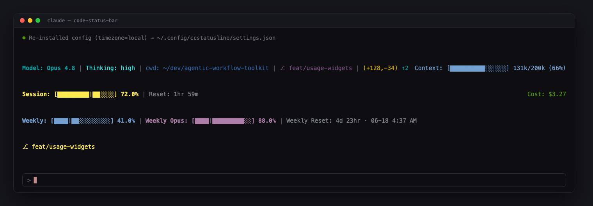
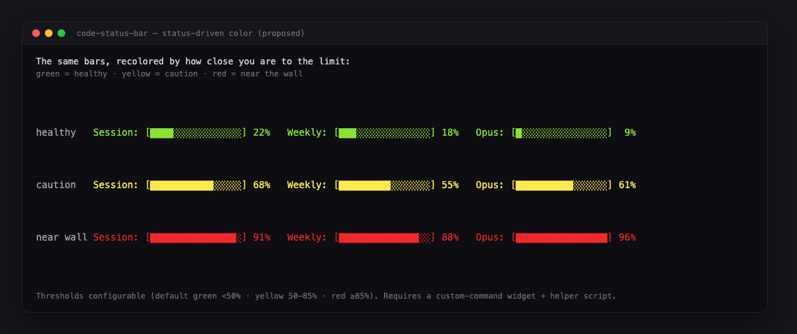

# Code Status Bar

A status line for **Claude Code** that makes a coding session legible at a glance. It puts the things the agent normally hides — **usage limits, cost, context health, and exactly where you are in version control** — one glance away, on every render. Built on [ccstatusline](https://github.com/sirmalloc/ccstatusline).

> A module of the [Agentic Workflow Toolkit](../). It targets **Claude Code** (via ccstatusline). The headline widgets — session and weekly **rate limits** — are an Anthropic subscription concept, so this config is Claude-specific by design.



## Build it yourself? You could — that's the point

ccstatusline is a capable, open tool: every widget here is one you could add by hand in its interactive terminal editor. But "by hand" is real time — adding ~20 widgets across four lines, setting each one's color, display mode, pace cursor, and metadata, wiring the flex layout and the colored-bar helper, all by clicking through a TUI. This repo is **that afternoon already spent.**

So you get both halves:

- **Zero-config install.** One command, no setup — a considered bar working in your next session, instead of a blank statusline and a configuration session.
- **Still fully yours to edit.** It's a plain JSON file (plus one small, readable script). Open ccstatusline's editor and tweak any widget, or hand-edit the JSON directly. Nothing is compiled, hidden, or locked — recolor a bar, drop a line, move a field.

That combination is the **transparency** this toolkit is built on: a shortcut that costs you nothing in visibility or control. You save the upfront time *and* keep the ability to see exactly what it does and make it your own — the opposite of a black box.

## How it's organized

Each line answers exactly one question:

1. **Where am I, and how is the agent configured?**
2. **How close am I to the short-term (5-hour) limit, and what is this session costing?**
3. **How close am I to the weekly limits, and when do they reset?**
4. **Am I in a git worktree?** — *this line only appears when you are.*

### The reading that matters most: the pace cursor

The usage bars aren't plain fill gauges. Each draws a `│` cursor marking how far you are *through the reset window in time*. The rule:

> **If the filled bar is ahead of the `│`, you're burning faster than the clock — you'll hit the limit before it resets.** Behind the cursor, you're fine.

So `Weekly Opus: [████│█████████░░] 88.0%` with the cursor near the start means you're way ahead of pace and will exhaust the weekly Opus budget days early. That's the point: not just *how much is left*, but *whether you're on track*.

## Field by field — what it is, and why it earns the space

A status line is ~3–4 lines of prime real estate; every field competes. Our rule: **a field earns a spot only if it changes a decision you'd make while coding.** Here's the case for each.

### Line 1 — workspace & agent configuration

- **`Model: Opus 4.8`** — which model is answering. Capability and cost vary enormously between models, so this is the single most decision-relevant fact on the bar; every other number is read relative to it. A wrong assumption here ("I thought I was on Sonnet") changes everything — that's why it leads.
- **`Thinking: high`** — the reasoning-effort level. Higher effort means deeper reasoning *and* faster token burn, so it's the honest answer to "why is this slower / more expensive right now?" It shows `default` at rest, which is itself information (you're *not* in a high-burn mode). *Caveat: Claude Code can report this inaccurately when several sessions run at once.*
- **`cwd: ~/.../project`** — the working directory, home-abbreviated and trimmed to the last few segments. Cheap insurance against the classic mistake of acting in the wrong checkout.
- **`⎇ feat/x`** — the current git branch; the anchor for the next two fields.
- **`(+128,-34)`** — lines added/removed in the working tree: a continuous read on how much uncommitted work is at risk.
- **`↑2` (ahead/behind)** — commits ahead of / behind your upstream. **Hidden whenever you're in sync, have no upstream, or aren't in a repo** — so it costs zero space until the moment it matters, then catches "forgot to push" and "I'm building on a stale base."
- **`Context: [██████████░░░░░░] 131k/200k (66%)`** — how full the context window is. This is your early warning for quality: as it fills, the agent's grip on the conversation weakens and an auto-compaction (a lossy summarization) looms. It's the cue to wrap a thread or `/clear` *before* quality degrades.
- **`↻ 2` (compaction counter)** — how many times context has auto-compacted this session, i.e. how many times the agent silently summarized and dropped detail. **Hidden at zero.** A silent failure mode made visible: if you see `↻ 3`, that explains why the agent "forgot" something.

### Line 2 — the session / 5-hour limit, and cost

- **`Session: [█████████│██░░░░] 72.0%`** — percent of Claude Code's **5-hour rolling limit** used, with the pace cursor. This is the limit that throttles you *today* — the closest thing to a daily budget, and the most important single gauge if you work in long bursts.
- **`Reset: 1hr 59m`** — time until that 5-hour window resets. Paired with the bar it becomes an actionable sentence: "72% used, frees up in ~2h."
- **`Cost: $3.27`** — **the total US-dollar cost of the current session**, taken straight from Claude Code's own accounting (`cost.total_cost_usd`). This is the field people are most surprised we keep, and it's the most on-brand for the whole toolkit: the agent is spending real money on your behalf, and you should see it without opening a dashboard. Cost-awareness quietly changes behavior — you notice when a session has gotten expensive and make different calls about scope and model. **Transparency about money is the purest form of candor here**, which is exactly why it earns a permanent slot rather than living in a billing page you never open.

### Line 3 — the weekly limits, and when they reset

- **`Weekly: [████│██░░░░░░░░░] 41.0%`** — percent of your **overall weekly limit** used, with pace cursor. The slower ceiling that governs your whole week.
- **`Weekly Opus: [████│█████████░░] 88.0%`** — the **separate weekly Opus budget** (the one Max users hit first). It's broken out because Opus is metered apart from everything else: you can be fine on the overall weekly and still be about to lose Opus for the week. The pace cursor makes "you'll run out of Opus by Thursday" visible on Monday.
- **`Weekly Reset: 4d 23hr · 06-18 4:37 AM`** — time remaining **and** an absolute local timestamp. The duration tells you "about 5 days"; the date lets you actually plan around it ("frees up Wednesday morning"). The 5-hour reset on Line 2 stays duration-only on purpose — a calendar date is noise for a window that always resets the same day.

### Line 4 — worktree (only when present)

- **`⎇ feat/x`** — the active git worktree, shown **only when Claude Code reports you're in one**; the whole line disappears otherwise. For worktree-heavy workflows it's the guardrail against editing the wrong checkout. (It reads Claude Code's worktree signal — see [Notes](#notes).)

## Design choices worth knowing

- **Pace cursor over color alarms.** ccstatusline doesn't recolor a bar red at 90% — widget colors are static. The live signal is *fill vs. cursor* plus the percentage, and we lean into that instead of faking a threshold.
- **Zero extra latency.** Session and weekly numbers come straight from the status payload Claude Code already hands the bar (`rate_limits`), so there's no API call and no lag.
- **No special fonts.** Every glyph (`█ ░ │ ⎇ ↑ ↻ ·`) is standard Unicode, so it renders in any modern terminal. Powerline is off by default for the same reason.
- **Self-localizing time.** The weekly reset timestamp uses `"timezone": "local"`, so it renders in each user's own timezone with no setup.

## Color — static by default, status-driven by opt-in

Out of the box the bars use **static** colors: each usage bar keeps one fixed hue, and the at-a-glance signal is the **fill** and the **pace cursor**, not the color. That's deliberate — the default is a single portable JSON file with zero dependencies that works in any terminal.

There's also an **opt-in colored variant** that recolors each usage bar by how close you are to its limit — **green** (healthy) → **yellow** (caution) → **red** (near the wall):



### What it costs

ccstatusline's usage widgets can't recolor by value, so the colored variant renders the three usage bars through a tiny Node helper (`scripts/usage-bar.cjs`) wired in as a `custom-command` widget. That buys the color, but:

- it ships a **helper script** the installer places at `~/.config/ccstatusline/scripts/usage-bar.cjs`, and the config calls it;
- it needs **Node on your PATH** at render time (you already have it — ccstatusline runs on Node);
- it's **less portable** than the pure-JSON default (Windows shells, locked-down environments);
- the thresholds live in the script (default green `<50%` · yellow `50–85%` · red `≥85%`) — edit to taste.

Everything else on the bar (model, context, cost, timers, worktree) stays native in both variants; only the three usage bars change.

### Why it's worth acclimating to

Color is **pre-attentive** — your visual system registers *red* before you consciously read a single digit. Once your eye is trained on the green→yellow→red gradient, the usage bar stops being something you *read* and becomes something you *feel*: you glance over, catch red on the Opus line, and ease off without ever parsing "88%."

That ambient, near-zero-effort awareness is the entire point of a status bar, and it's the strongest form of the **candor** this toolkit is built on — the truth reaches you before you go looking for it. The cost is one script and one dependency; if you live in this tool all day, training that reflex pays for itself fast. The static default is the honest, portable floor; the colored variant is the upgrade for people ready to internalize the signal.

## Install

### Prerequisites

- **Claude Code**, and **ccstatusline** available (`npx -y ccstatusline@latest` works out of the box, or install it globally).

### One command

```bash
curl -fsSL https://raw.githubusercontent.com/AllenBW/agentic-workflow-toolkit/main/code-status-bar/install.sh | bash
```

Backs up any existing config, installs `settings.json`, and prints how to wire it into Claude Code.

For the **colored variant** (also places the Node helper script):

```bash
curl -fsSL https://raw.githubusercontent.com/AllenBW/agentic-workflow-toolkit/main/code-status-bar/install.sh | bash -s -- --colored
```

### Manual

```bash
mkdir -p ~/.config/ccstatusline
cp ~/.config/ccstatusline/settings.json ~/.config/ccstatusline/settings.json.bak 2>/dev/null || true
curl -fsSL https://raw.githubusercontent.com/AllenBW/agentic-workflow-toolkit/main/code-status-bar/settings.json \
  -o ~/.config/ccstatusline/settings.json
```

### Wire it into Claude Code

Point your Claude Code `~/.claude/settings.json` status line at ccstatusline:

```json
{
  "statusLine": {
    "type": "command",
    "command": "npx -y ccstatusline@latest",
    "padding": 0,
    "refreshInterval": 10
  }
}
```

(`refreshInterval` needs Claude Code ≥ 2.1.97.) Open a new session and the bar appears.

### Hand it to your agent

Already running Claude Code with ccstatusline available? Paste this and let the agent install it:

```text
Install the "Code Status Bar" config from the Agentic Workflow Toolkit.

1. Back up my current ccstatusline config if it exists:
   cp ~/.config/ccstatusline/settings.json ~/.config/ccstatusline/settings.json.bak-$(date +%s) 2>/dev/null || true
2. Download the config into place:
   mkdir -p ~/.config/ccstatusline
   curl -fsSL https://raw.githubusercontent.com/AllenBW/agentic-workflow-toolkit/main/code-status-bar/settings.json -o ~/.config/ccstatusline/settings.json
3. Make sure ~/.claude/settings.json has a statusLine block running ccstatusline
   ("type":"command", "command":"npx -y ccstatusline@latest"); add it if missing,
   WITHOUT disturbing any of my other settings.
4. Confirm the installed file is valid JSON, then tell me to open a new session to see it.

Do not change any other part of my Claude Code configuration.
```

## Customize

- **Bigger bars:** change any usage widget's `metadata.display` from `progress-short` (16 cols) to `progress` (32 cols).
- **Powerline theme:** set `powerline.enabled: true` and `powerline.theme` to `tokyonight` / `nord` / `dracula` / etc. (needs a Nerd Font).
- **Pay-as-you-go overage:** add an `extra-usage-utilization` widget with `metadata.hideIfDisabled: "true"`. Note it triggers a usage API fetch (it's the one usage field *not* in the status payload), so it's off by default.
- **Sonnet weekly bucket:** add a `weekly-sonnet-usage` widget alongside the Opus one.

## Notes

- **Worktree detection** uses Claude Code's `worktree` signal in the status payload (populated for Claude-Code-tracked worktrees). It auto-hides when absent, which is exactly why the line can vanish cleanly — the trade-off vs. raw filesystem detection, which can't self-hide.
- **Threshold coloring** isn't in ccstatusline's stock widgets — the [colored variant](#color--static-by-default-status-driven-by-opt-in) above adds it via a `custom-command` helper (`scripts/usage-bar.cjs`).

## Credits

Rendering by [**ccstatusline**](https://github.com/sirmalloc/ccstatusline) (by sirmalloc). This module is the curated config plus the rationale for every field; the engine is theirs.
